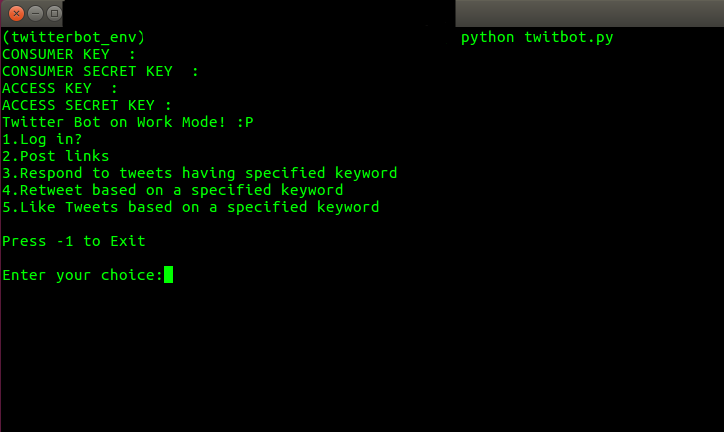

# Twitter AutoPoster Bot

 
## Table of contents
* [Description](#description)
* [Depedencies](#depedencies)
* [Setup](#setup)
* [Features](#features)
* [Contribute to this Project](#contribute-to-this-project)
* [Contributors](#contributors)
* [Contact](#contact)
* [License](#license)

## Description
This is a Command-Line Interface for a Twitter Bot written in Python.
	
## Dependencies
Project is created with:
* Python version: 3.6.8
* Tweepy version: 3.8.0
* Selenium library version: 3.141.0
* You will also need a Twitter developer account. Check [this link](https://iag.me/socialmedia/how-to-create-a-twitter-app-in-8-easy-steps/) for details on how to get one.
	
## Setup
To run this project, download the `twitbot.py` Python Script after cloning this repository.
Python 3.6 or higher is preferred for smooth running, also Tweepy and Selenium must be installed.

#### Installing Python 3.6 
Try [this](https://askubuntu.com/questions/865554/how-do-i-install-python-3-6-using-apt-get).

#### Installing Tweepy
Try [this](https://stackoverflow.com/questions/31325305/install-tweepy-on-ubuntu).

#### Installing Selenium
This Script has been written for the Firefox browser.  
Try [this](https://askubuntu.com/questions/937770/how-to-install-and-set-up-selenium-webdriver-on-ubuntu-16-04) to install Selenium, and [this](https://askubuntu.com/questions/851401/where-to-find-geckodriver-needed-by-selenium-python-package) for geckodriver required for Firefox(likewise ChromeDriver for Chrome).

## Run this project
Execute this script from the terminal/command line using 
`python twitbot.py`  

You will be prompted for the following 
- your Consumer API Key
- Consumer API Secret Key
- Access Token
- Access Token Secret Key

On entering these details, you will be greeted with a menu as shown in the screenshot above. To login to your Twitter account you will be prompted with your username and password, once they are specified, this script automatially logs in to your Twitter Account.
<!--- Add screenshots for various functions so that it's clear what has been done. ---> 

## Features
* Automatic Login(prompts user for username and password on the terminal)
* Retweets based on specified keyword
* Likes Tweets based on specified keyword
* Posts insightful links(reads insightful links from a file and posts them as tweets)
* Replies to Tweets having a specified keyword

## Contribute to this Project
To contribute to this Project, follow these steps:
- Fork this repository.
- Create a branch: git checkout -b <branch_name>.
- Make your changes and commit them: git commit -m '<commit_message>'
- Push to the original branch: git push origin <project_name>/<location>
- Create the pull request.

Alternatively see the GitHub documentation on [creating a pull request](https://help.github.com/en/github/collaborating-with-issues-and-pull-requests/creating-a-pull-request).

## Contributors
This project is developed and maintained by [@dvlpsh](https://github.com/dvlpsh).

## Contact
Reach me at my email: [dvlpsh21@gmail.com](mailto:dvlpsh21@gmail.com).

## License
This project uses the following LICENSE: [MIT LICENSE](LICENSE).

